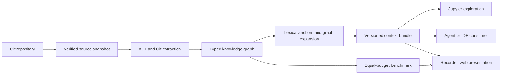

# Code Knowledge Graph

An explainable, reproducible way to retrieve code context for developers and AI agents.

[Explore the live presentation](https://code-knowledge-graph.vercel.app/)

The project indexes a Git repository into a typed graph, retrieves text-relevant anchors,
and expands them through the strongest code relationships. Every result explains why a
node was selected and records the exact source snapshot that produced it.

[Implicit Decision Gate](https://github.com/genesobolev/implicit-decision-gate) is the
reference codebase for the included demo. The implementation is local Python and does not
use Oracle services, databases, or tools.

## Why this complements an AI development platform

An agent can retrieve a function with lexical search and still miss the test, caller,
policy, or recently co-changed file that makes the function useful. This project treats
code context as a ranked, inspectable product surface:

- Lexical relevance finds likely answer nodes.
- Static structure and Git history connect callers, tests, imports, inheritance,
    containment, instantiation, and co-change evidence.
- Strongest-path expansion ranks related nodes under a fixed retrieval budget.
- Versioned JSON and Markdown bundles provide a stable integration boundary for agents,
    IDEs, and future tool adapters.
- Repository provenance makes generated context reproducible and auditable.
- A frozen benchmark shows benefits and regressions instead of assuming that graph
    expansion is always better.

## What is included

- A reusable `code_knowledge_graph` Python package.
- A Jupyter walkthrough with native Plotly notebook output.
- A CLI for deterministic graph artifacts and query bundles.
- A 14-query, manually reviewed retrieval benchmark.
- A versioned query-bundle schema and agent-consumer example.
- A presentation-only web app backed entirely by committed JSON.

The graph currently recognizes these relationship types:

| Relationship | Evidence |
| --- | --- |
| `CONTAINS` | File and Python symbol nesting |
| `IMPORTS` | Resolved Python imports |
| `CALLS` | Resolved Python call sites |
| `INSTANTIATES` | Calls resolved to classes |
| `INHERITS` | Resolved Python base classes |
| `TESTS` | Test references to implementation symbols |
| `CO_CHANGES` | Files changed together in Git history |

## Architecture



The web app has no backend and makes no model, repository, or third-party API calls. It
loads only same-origin, precomputed data from `web/public/data`.

## Quick start

Requirements: Python 3.12, Git, and
[uv](https://docs.astral.sh/uv/getting-started/installation/).

```bash
uv sync --group dev
```

Build a local development artifact from any Git repository:

```bash
uv run code-knowledge-graph index \
    --repo ../implicit-decision-gate \
    --out artifacts/graph.json
```

Query the saved graph as JSON or Markdown:

```bash
uv run code-knowledge-graph query \
    --graph artifacts/graph.json \
    --query "What prevents concurrent resume from executing twice?" \
    --format markdown
```

To include source, explicitly name a reviewed, ranked node. Snippets are capped at eight
items and 800 characters each.

```bash
uv run code-knowledge-graph query \
    --graph artifacts/graph.json \
    --query "Where is resume concurrency enforced?" \
    --format json \
    --include-source \
    "symbol:tests/test_orchestrator.py::test_concurrent_resumes_execute_attempt_two_once"
```

CLI payloads are written to standard output and diagnostics to standard error, so the
JSON result can be piped safely to another tool.

## Notebook

The [notebook](knowledge_code_graph.ipynb) is a portable walkthrough over the package. It
uses `CODE_GRAPH_TARGET` when set and otherwise looks for an `implicit-decision-gate`
checkout beside this repository.

```bash
CODE_GRAPH_TARGET=../implicit-decision-gate \
    uv run jupyter lab knowledge_code_graph.ipynb
```

Its Plotly figures use native notebook MIME output, which renders in VS Code and
JupyterLab without a relative iframe. The notebook is not Jupytext-paired, so changing or
saving its kernel cannot create a stale paired-file conflict.

## Reproducible artifacts

Development mode permits a dirty target and records that fact. Public and demo modes
require both a clean worktree and an exact 40-character commit SHA:

```bash
uv run code-knowledge-graph index \
    --repo ../implicit-decision-gate \
    --out artifacts/graph.json \
    --mode public \
    --expected-commit 2fdbb3deab2967a545d8a898a17a380974e6bb17
```

Each artifact records:

- Commit and tree SHAs.
- Branch or detached-head state.
- Clean or dirty worktree state.
- Complete or shallow Git history state.
- A SHA-256 manifest of every indexed source path and byte sequence.
- Graph schema, extractor version, and retrieval parameters.

Public artifacts reject shallow history because co-change edges depend on the full commit
history. Source symlinks are rejected so indexing cannot follow a tracked path outside the
repository. The local repository root is never serialized. Remote URLs are stripped of
credentials, queries, fragments, and local paths. Extraction verifies the snapshot again
after graph construction and fails if the repository changed during indexing.

## Retrieval evaluation

The checked-in benchmark is pinned to the clean reference snapshot above. It compares a
direct TF-IDF baseline and graph-expanded retrieval at the same 20-node budget.

| Metric | Lexical | Graph-expanded |
| --- | ---: | ---: |
| Answer MRR at 10 | 0.524 | 0.524 |
| Overall recall at 10 | 0.571 | 0.667 |
| Overall recall at 20 | 0.714 | 0.810 |
| Supporting-context recall at 10 | 0.464 | 0.607 |

Graph expansion improves contextual recall in this reviewed set while answer MRR is tied.
It also regresses on two queries, `clean-worktree` and `cli-lifecycle`. This is a small,
illustrative benchmark—not a claim of statistical superiority—and the misses are exposed
in the web app for inspection.

The source judgments live in
[benchmarks/implicit-decision-gate-v1.json](benchmarks/implicit-decision-gate-v1.json).
Metric definitions and per-query outcomes are preserved in
[web/public/data/evaluation.json](web/public/data/evaluation.json).

## Query-bundle contract

Every query can be exported as a versioned `QueryBundle` containing:

- Sanitized repository provenance and retrieval parameters.
- Ranked lexical anchors and relationship-ranked related nodes.
- Strongest paths with explicit traversal direction.
- Selected edges with type, strength, confidence, count, and evidence.
- Repository-relative source locations.
- Optional, bounded, explicitly reviewed source snippets.

See [query-bundle-v1.schema.json](schemas/query-bundle-v1.schema.json) for the JSON Schema
and [consume_context.py](examples/consume_context.py) for a network-free example that
turns a frozen bundle into agent-ready context.

## Static presentation app

Regenerate the committed demo data only from the expected clean reference snapshot:

```bash
uv run python scripts/build_demo_data.py \
    --repository ../implicit-decision-gate
```

Serve the app locally:

```bash
uv run python -m http.server 8000 --directory web/public
```

Then open `http://localhost:8000`. The app supports recorded-query selection, graph
pan and zoom, relationship filtering, score thresholds, node and path inspection,
evaluation drill-down, provenance, and copyable JSON or Markdown context.

## Validation

```bash
uv run ruff format
uv run ruff check --fix
uv run mypy .
uv run pytest
```

The ordinary test suite builds temporary Git repositories, so it does not require the
reference checkout. Regenerating the public demo is the explicit integration check
against the pinned external repository.

## Current boundaries

- Python receives AST-level symbol relationships; other supported text formats are
    currently indexed as file nodes.
- Call and test resolution is static and heuristic. Dynamic dispatch and runtime-only
    behavior can be missed.
- Co-change is correlation from Git history, not proof of architectural coupling.
- Relationship strengths are explainable ranking signals, not probabilities.
- The static site replays reviewed results; it intentionally does not accept live code or
    run arbitrary queries.
